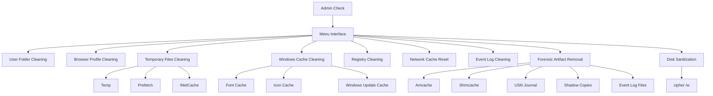

# GrimSweep

------------------------------------------------------------------------

# Overview

**GrimSweep** é uma ferramenta de limpeza profunda para sistemas Windows
criada para estudo de:

-   Digital Forensics
-   Artifact Persistence
-   Anti‑Forensics Techniques
-   Data Sanitization

O script automatiza a remoção de **diversos artefatos investigativos
utilizados por analistas forenses**.

⚠️ Ferramenta extremamente destrutiva.\
Nunca execute em sistemas de produção.

------------------------------------------------------------------------

# Security Research Context

O GrimSweep permite estudar como sistemas Windows armazenam rastros de
atividade e como esses rastros podem ser removidos.

Principais objetivos do projeto:

-   entender persistência de artefatos
-   estudar técnicas de limpeza de sistema
-   observar impactos na análise forense
-   analisar recuperação de dados após sanitização

------------------------------------------------------------------------

# Arquitetura do Script

O GrimSweep possui arquitetura modular baseada em camadas de limpeza.

------------------------------------------------------------------------

# Módulos Principais

## 1 --- Limpeza de Pastas do Usuário

Remove conteúdo de:

-   Desktop
-   Downloads
-   Documents
-   Pictures
-   Videos
-   Music
-   OneDrive

------------------------------------------------------------------------

## 2 --- Perfis de Navegadores

Remove completamente perfis de:

-   Chrome
-   Edge
-   Firefox
-   Brave
-   Opera
-   Vivaldi

Dados removidos:

-   cookies
-   sessões
-   histórico
-   cache
-   perfis

------------------------------------------------------------------------

## 3 --- Arquivos Temporários

Remove:

-   `%TEMP%`
-   `Windows Temp`
-   `Prefetch`
-   `INetCache`
-   `Recent Files`
-   `Thumbnail Cache`

------------------------------------------------------------------------

# Seção de Análise Forense

Esta parte é a mais relevante para pesquisadores de segurança.

O GrimSweep remove artefatos que normalmente são utilizados em
investigações digitais.

------------------------------------------------------------------------

## Amcache

Local:

    C:\Windows\AppCompat\Programs\Amcache.hve

O Amcache registra:

-   executáveis executados
-   hashes de arquivos
-   caminhos de execução
-   timestamps

Analistas utilizam este artefato para reconstruir execução de programas.

------------------------------------------------------------------------

## Shimcache (AppCompatCache)

Local no registro:

    HKLM\SYSTEM\CurrentControlSet\Control\Session Manager\AppCompatCache

Contém registros de executáveis carregados pelo sistema.

Não garante execução real, mas indica que o arquivo foi **processado
pelo loader do Windows**.

------------------------------------------------------------------------

## USN Journal

Comando removido pelo script:

    fsutil usn deletejournal /D C:

USN Journal registra:

-   criação de arquivos
-   renomeações
-   exclusões
-   modificações

É uma das fontes mais valiosas para **timeline forense**.

------------------------------------------------------------------------

## Shadow Copies

Removidas via:

    vssadmin delete shadows /all

Shadow Copies são snapshots usados por:

-   restauração do sistema
-   recuperação de arquivos
-   análise de estado anterior do sistema

------------------------------------------------------------------------

## Event Logs

Logs removidos:

-   Application
-   System
-   Security
-   Setup
-   PowerShell

Arquivos físicos:

    C:\Windows\System32\winevt\Logs

Esses logs normalmente contêm evidências críticas de atividades do
sistema.

------------------------------------------------------------------------

# Sanitização de Disco

O GrimSweep pode sobrescrever espaço livre usando:

    cipher /w:C:

Isso executa múltiplas gravações no espaço livre para dificultar
recuperação.

⚠️ Pode levar várias horas dependendo do tamanho do disco.

------------------------------------------------------------------------

# Estatísticas de Superfície de Limpeza

Categorias removidas pelo GrimSweep:

  Categoria            Tipo
  -------------------- ---------------------
  User Data            Arquivos pessoais
  Browser Artifacts    Histórico e sessões
  System Caches        Prefetch, IconCache
  Registry History     RunMRU, TypedURLs
  Network Artifacts    DNS, ARP
  Forensic Artifacts   Amcache, Shimcache
  Filesystem Journal   USN
  System Snapshots     Shadow Copies
  Event Logs           .evtx

------------------------------------------------------------------------

# Requisitos

-   Windows
-   Python 3.x
-   privilégios de administrador

------------------------------------------------------------------------

# Execução

Execute como administrador:

    python GrimSweep.py

------------------------------------------------------------------------

# Aviso

Este projeto foi criado **exclusivamente para fins educacionais e de
pesquisa**.

Não utilize em sistemas sem autorização.

------------------------------------------------------------------------
